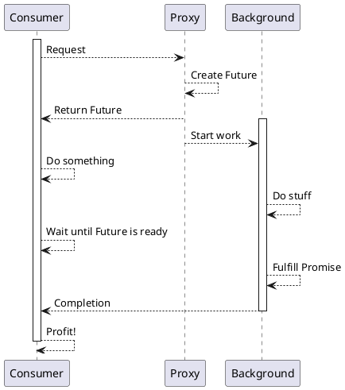

# 함수형 프로그래밍

- 문제 발생 원인은? 공유 자원 -> **가변 공유 자원**
- 불변이 기본이라면? -> 함수형 프로그래밍

## Thread safe

어떤 함수가 Thread safe한지 보장하는 방법은?

- 왜 Thread safe가 보장되어야 하는가?
- 반대로 Thread unsafe를 보장하면 어떨까?

어떨 때 Thread unsafe가 되는가?

- ~~내부에 공유 상태를 가질 때~~
- 내부에 **가변** 공유 상태를 가질 때

## Iterator

```java
final List<Player> players = new LinkedList<Player>();
public synchronized void add(Player p) {
    players.add(p);
}
// synchronized가 여기서 무얼 해줄 수 있는가?
public synchronized Iterator<Player> getPlayerIterator() {
    return players.iterator();
}
```

해결법은?


- `ConcurrentSkipList`
- `CopyOnWriteArrayList`
- ...

하지만 만약 이런 공유 자원이 없는 함수를 만들면 어떤 이점이 있을까?

## 병렬성

- stream으로 연결되는 함수를 pure functional하게 만들면 side-effect를 모두 제거할 수 있을까?
- 외부 참조하지 않고 오로지 local variable과 arguments만 써보자.

```java
// map-reduce로 구조를 분리했을 때 얻는 이점은?
static Map<String, Long> countWords(String sentence) {
    return Arrays.stream(sentence.split("\\s+")) // map
            .parallel() // 문제 없나?
            .reduce(new HashMap<>(), WordCount::reduceCount, WordCount::mergeMap); // reduce
}

// 이 함수는 thread safe한가?
static Map<String, Long> reduceCount(Map<String, Long> map, String word) {
    // map 변수는 thread safe한가?
    map.compute(word, (unused, oldMaybe) -> oldMaybe != null ? oldMaybe + 1 : 1);
    return map;
}

static Map<String, Long> mergeMap(Map<String, Long> map1, Map<String, Long> map2) {
    // 왜 merge할 때 객체를 새로 만드는가? 그냥 map1 += map2하면 안 될까?
    Map<String, Long> merged = new HashMap<>(map1);
    merged.putAll(map2);
    return merged;
}
```

이러면 올바르게 고쳐질까?

```java
static Map<String, Long> reduceCount(Map<String, Long> map, String word) {
    // 반환은 새로하지만 이 때 map은 정말 문제가 없을까?
    Map<String, Long> newMap = new HashMap<>(map);
    newMap.compute(word, (unused, oldMaybe) -> oldMaybe != null ? oldMaybe + 1 : 1);
    return newMap;
}
```

그러면 어떻게 해야 하나? `ConcurrentHashMap`을 쓰기 전에 조금 더 고민해보자.

```java
static Map<String, Long> countWords(String sentence) {
    return Arrays.stream(sentence.split("\\s+"))
            .collect(Collectors.groupingBy(w -> w.charAt(0))) // partition
            .values()
            .parallelStream()
            .map(WordCountPartitioned::localReduceCount) // parallel로 동작하는가?
            .reduce(WordCountPartitioned::mergeAll) // parallel로 동작하는가?
            .orElse(new HashMap<>());
}

// 이 함수는 thread safe한가? localWords는 변하지 않는가?
static Map<String, Long> localReduceCount(List<String> localWords) {
    return localWords.stream()
            .collect(Collectors.groupingBy(Function.identity(), Collectors.counting()));
}

static Map<String, Long> mergeAll(Map<String, Long> map1, Map<String, Long> map2) {
    // 만약 여기서 map1 += map2를 하면 어떻게 될까?
    Map<String, Long> merged = new HashMap<>(map1);
    merged.putAll(map2);
    return merged;
}
```

왜 이 함수들은 병렬도 동작할 수 있는가?

- side effect가 없다.
- 이는 함수 내에서 외부 context에 의존하지 않음을 뜻한다.
- 이는 함수의 인자도 안전해야 한다는 것을 뜻한다.
- 불변이 기본인 세상에서는 걱정거리가 줄어든다.

### 구조에 대한 고찰

- 기본적으로 분할+정복
- 효율 향상을 위해 batch 처리
- 불변성을 유지하기 위해 매번 새로 만드는건 좋은 전략이지만, 안 만들고도 처리할 수 있다면 제일 좋다.
  - 하지만 이를 위해 불변성을 포기해야 하는 경우가 생긴다면 아주 신중해야 한다. 경우에 따라 차라리 성능을 포기하고 불변성을 유지하는 편이 더 안심할 수 있다.
- map 과정을 병렬화할 수는 없을까? `Collectors.groupingByConcurrent`
  - 이들은 어떻게 동작하는가?
  - 이는 정말 효율적인가?
- stream에 item이 몇 개일 때 어떤 전략이 효율적일까? _마치 sort와 같은 문제_

## 더 공부해볼 내용

- map/reduce 구조 연습
- Lazy를 잘 사용해보자
- 함수형: fold를 통한 reduce 병렬화 해보자.
  - `parallelStream`
  - Java의 parallel이나 concurrent 코드 구현을 보고 공부해볼 수 있다.

## 참조 투명성

- [Wiki:Referential transparency](https://en.wikipedia.org/wiki/Referential_transparency)

> 참조 투명성와 참조 투명도는 컴퓨터 프로그램의 일부 속성이다.  프로그램 동작의 변경없이 관련 값을 대체할 수 있다면 표현식을 참조 상 투명하다고 할 수 있다. 그 결과, 참조 상 투명한 함수를 평가하게 되면 동일한 인자에 대해 동일한 값을 반환해야 한다. **그러한 함수를 순수 함수라고 부른다.** 참조상 투명하지 않은 표현식은 참조상 불투명 하다고 한다.

## Future/Promise



작업에 대한 request와 completion을 분리할 수 있다.

1. 작업을 요청하면 결과를 주겠다는 약속(Promise)을 하고
2. 약속이 이행되었을 때 결과를 받을 수 있는 미래(Future)를 준다.
3. 작업을 처리한 이후 그 성공/실패 결과를 미래에 채우면(Fulfill)
4. 그 약속이 완료된 미래에 처리해야 할 다음 일을 처리할 수 있다.

Java에서는 `CompletableFuture`를 사용해서 처리한다.

### 더 공부해볼 내용

- future와 future-call의 차이점은?
- future를 non-blocking으로 대기하려면 어떻게 해야 할까?
- future를 취소할 수 있을까?

## 최종 정리

### 장점

- 기본이 불변
- 참조 투명성

### 단점

- 시스템의 효율성?
